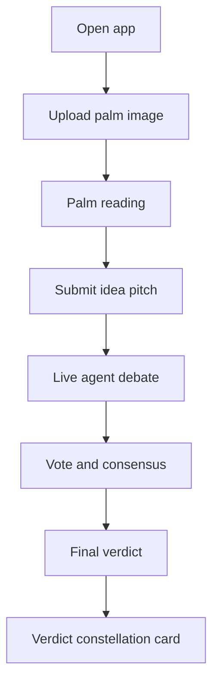
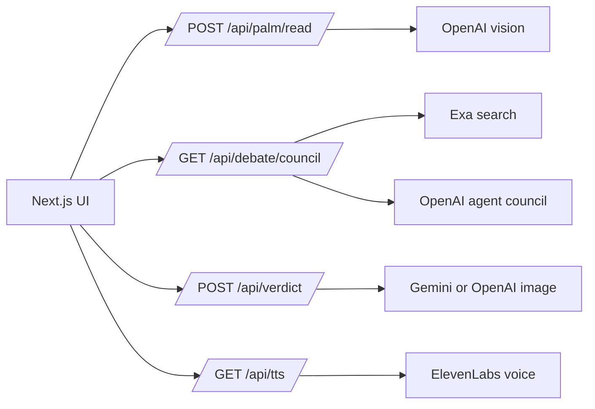

# The Mystic Court

AI ritual app: upload a palm photo, pitch an idea, watch five agents debate it, then receive a verdict constellation card.

## Stack

- Frontend: Next.js, React, Tailwind
- Backend: FastAPI, SSE, OpenAI, Exa, Gemini, ElevenLabs

## Setup

```bash
cp .env.example .env
```

Fill in the keys in `.env`:

```bash
OPENAI_API_KEY=
EXA_API_KEY=
ELEVENLABS_API_KEY=
GEMINI_API_KEY=
```

Start the backend:

```bash
cd backend
pip install -r requirements.txt
uvicorn main:app --reload --port 8000
```

Start the frontend:

```bash
cd frontend
npm install
npm run dev
```

Open `http://localhost:3000`. The frontend calls the API at `http://localhost:8000`.

## Functionality

- Palm scan: analyzes an uploaded palm image and returns image quality, dominant element, landmarks, themes, strengths, cautions, suggestions, and a destiny score.
- Idea court: streams a moderated five-agent debate over Server-Sent Events.
- Research context: pulls Exa snippets to ground the debate.
- Consensus: collects agent votes for `GO`, `NO_GO`, or `PIVOT`.
- Verdict: generates a final prophecy, winning agent, alignment score, and verdict constellation card image.
- Voice: exposes a text-to-speech endpoint for spoken output.

## Flow

1. Upload a palm image for a structured reading.
2. Submit an idea pitch to stream a five-agent debate.
3. Generate the final verdict and verdict constellation card.





Optional image model overrides are documented in `.env.example`.
